# CSS for JS Devs

## Fundamentals Recap
### Media Queries

The web is an incredibly broad platform: the same HTML and CSS might be tasked with running on a 5" phone screen and a 72" TV!

In order to accommodate screens of different shapes and sizes, CSS features **media queries**, which allow us to apply different CSS in different scenarios.

Media queries use the `@media` syntax. You can kinda think of it as an `if` statement in JavaScript.

```js
if (condition) {
  // Some JS that will run if the condition is met
}
```

```css
@media (condition) {
  /* Some CSS that'll run if the condition is met */
}
```

An example:

```html
<div class="small-only">
  Hello there!
</div>
```

```css
@media (max-width: 300px) {
  .small-only {
    color: red;
  }
}
```

In this case, the condition is `max-width: 300px`. If the window is between 0px and 300px wide, the CSS within will be applied.

#### Hiding content

The conditional ability of media queries allows us to also hide content...

It's common to use media queries to have alternative interfaces depending on the screen size

```html
<div class="large-screens">
  I only show up on large screens.
</div>
<div class="small-screens">
  Meanwhile, you'll only see me on small ones.
</div>
```

```css
.large-screens {
  display: none;
}

@media (min-width: 300px) {
  .large-screens {
    display: block;
  }
  .small-screens {
    display: none;
  }
}
```

`display: none` is a declaration that removes an element from the rendering process; it's as if it doesn't exist.

By default, we'll hide any elements with the `large-screens` class.

If the window is at least `300px` wide, however, we apply special overrides. This includes showing `large-screens` elements, and hiding `small-screens` elements.

This trick is **often** used for navigation. Desktop users see a list of links, whereas mobile users see a hamburger icon.

#### Valid Conditions

Inside the parentheses, typically `max-width` to add styles on small screens, or `min-width` to add styles on larger ones. 

> `max-width` and `min-width` are not CSS properties, they are media features.
> `max-width` is also a css property, but in the context of media queries, remember its a media feature.

### Selectors

CSS comes with an incredibly rich set of selectors, and those selectors can be mixed and match in interesting ways.

The most straightforward selectors target a specific tag or class:

```css
/* Turn all links red! */
a {
  color: red;
}

/*
  Remove the underline from all elements that
  have been given a class of `navigation-link`
*/
.navigation-link {
  text-decoration: none;
}
```

#### Psuedo-classes

Psuedo-classes let us apply a chunk of CSS based on an element's current state.

```html
<style>
  button:hover {
    color: blue;
  }
</style>

<button>Hover over me!</button>
```

This code sample, with display a button with the text "Hover over me!".
Once the user hovers over the button, the text inside the button will turn blue.

This is similar to `onMouseEnter` / `onMouseLeave` events in JavaScript, but with built=in state management.

If done in JS, we'd need to register event listeners, but state management is needed to know if the element is *currently* being hovered.

And to avoid this, CSS makes life easier with Pseudo Classes.

Another example of a pseudo class is: `focus`

HTML comes with interactive elements like buttons, links and form inputs.

When we interact with one of these elements (etiher by clicking on it or tabbing to it), it becomes focused.

It'll capture keyboard input, so we can type into a form field or press 'Enter' to follow a link

The `:focus` pseudo-class allows us to apply styles exclusively when an interactive element has focus:

```html
<button>Hello</button>
<button>world</button>
<button>!</button>
```

```css
button:focus {
  border: 2px solid royalblue;
  background: royalblue;
  color: white;
}
```

When the elements appear, and you click on one of them or tab through the 3 buttons, you'll see the styling specified above.

There's also the `checked` pseudo-class

```html
<h1>Pizza Toppings</h1>
<br />
<label>
  <input type="checkbox" />
  Avocado
</label>
<br />
<label>
  <input type="checkbox" />
  Broccoli
</label>
<br />
<label>
  <input type="checkbox" />
  Carrots
</label>
```

```css
input:checked {
  width: 24px;
  height: 24px;
}
```

Browsers don't offer too much flexibility when it comes to checkboxes and radio buttons, but this neat trick lets you apply certain CSS properties depending on its status.

And finally there's the first/last child pseudo-class

Pseudo-classes aren't just for states like hover/focus/checked
They can also help apply conditional logic

For example, if there's a set of paragraphs within a `<section>`:

```html
<section>
  <p>This is a paragraph!</p>
  <p>This is another paragraph!</p>
  <p>
    What do you know, it's a third
    paragraph!
  </p>
</section>
```

```css
body {
  background-color: silver;
}
section {
  padding: 24px;
  background-color: white;
}
p {
  margin-bottom: 1em;
}
```

What this does is add space under the last/final paragraph
And that's caused by the styling we added on the p-selector

This rule is meant to add space between each paragraph, but it also **applies to the final paragraph** and if inspected in the browers dev tools, there will be an orange rectangle that represents margin... but that's not the designated effect.

So here's how to fix it:

```html
<style>
  p {
    margin-bottom: 1em;
  }
  p:last-child {
    margin-bottom: 0px;
  }
</style>

<section>
  <p>This is a paragraph!</p>
  <p>This is another paragraph!</p>
  <p>
    What do you know, it's a third
    paragraph!
  </p>
</section>
```

```css
body {
  background-color: silver;
}
section {
  padding: 24px;
  background-color: white;
}
```

The change should be obvious, the `:last-child` pseudo-class will only select `<p>` tags which are the **final** element within its container.
It needs to be the last child within its parent.

Similarly, the `:first-child` pseudo-class will match the first child within a parent container.

```html
<ul>
  <li>Apple</li>
  <li>Banana</li>
  <li>Carrot</li>
  <li>Durian</li>
</ul>
```

```css
li:first-child {
  color: red;
}
```

This will make the first item on the list the color red

Then there's also `:first-of-type` and `:last-of-type`
Almost identical to `:first-child` and `:last-child`, but they have a critical difference.

`:first-of-type` and `:last-of-type` depends on the type of the HTML tag

For example:

```html
<style>
  p:first-child {
    color: red;
  }
</style>

<section>
  <h1>Hello world!</h1>
  <p>This is a paragraph!</p>
  <p>This is another paragraph!</p>
</section>
```

The first child within the parent `<section>` tag is an `<h1>`.
Our `p:first-child` is looking for **situations** where a *paragraph* is the first child **within** a parent container.
It doesn't work in this case.

But, if we switch the selector to `p:first-of-type`, it *does* work:

```html
<style>
  p:first-of-type {
    color: red;
  }
</style>

<section>
  <h1>Hello world!</h1>
  <p>This is a paragraph!</p>
  <p>This is another paragraph!</p>
</section>
```

The `:first-of-type` pseudo-class ignores any siblings that aren't of the same type.
In this case, `p:first-of-type` is going to select the first paragraph within a container, regardless of whether or not it's the first child.

### Debugging in the browser

Debugging in the browser is what we already know, but a couple nice facts are:

* crossed out properties mean they're invalid or not being applied
* comments can be added in your css, using the `/* */` syntax
* Firefox has a better developer tool


## Rendering Logic 1

### Built-in Declarations and Inheritance

Fundamentally, the goal of CSS is to allow you to control the appearance and layout of your app's content.

You don't quite start with a blank canvas; HTML tags do include a few minimal styles. For example, here are the built-in styles for `<a>` tags, **in Chrome 86**:

```css
a {
  color: -webkit-link;
  cursor: pointer;
  text-decoration: underline;
}
```

These styles are part of the user-agent stylesheet.

Each browser includes their own stylesheet full of base styles like this.
There are some hard rules in the HTML specification, but for the most part, each browser comes up with its own default styles.
That's why focus rings look so different across browsers!

In the past, it was common to use a **CSS reset**, a copy-pastable CSS chunk that strips away these default styles, setting a blank canvas that looks the same across all browsers, to strip away many of these default user-agent styles.

These days, though, browsers are a bit more consistent in how they render elements, and there's a growing awareness that we shouldn't expect our sites/applications to be identical across browsers and devices.

Josh Comeau's CSS reset

```css
/*
  1. Use a more-intuitive box-sizing model.
*/
*, *::before, *::after {
  box-sizing: border-box;
}

/*
  2. Remove default margin
*/
* {
  margin: 0;
}

/*
  3. Allow percentage-based heights in the application
*/
html, body {
  height: 100%;
}

/*
  Typographic tweaks!
  4. Add accessible line-height
  5. Improve text rendering
*/
body {
  line-height: 1.5;
  -webkit-font-smoothing: antialiased;
}

/*
  6. Improve media defaults
*/
img, picture, video, canvas, svg {
  display: block;
  max-width: 100%;
}

/*
  7. Remove built-in form typography styles
*/
input, button, textarea, select {
  font: inherit;
}

/*
  8. Avoid text overflows
*/
p, h1, h2, h3, h4, h5, h6 {
  overflow-wrap: break-word;
}

/*
  9. Create a root stacking context
*/
#root, #__next {
  isolation: isolate;
}
```

### The Cascade

```html
<style>
  p {
    font-weight: bold;
    color: hsl(0deg 0% 10%);
  }

  .introduction {
    color: violet;
  }
</style>

<p class="introduction">
  Hello World
</p>
```

We've created two rules, one targeting a tag (`p`), another targeting a class (`introduction`). Then, we've created an HTML element that matches them both.

You may already know what happens here: we wind up with a bold, violet paragraph.
It plucks the `font-weight` declaration from the `p` tag, and the `color` declaration from the `.introduction` class.

The example shpwws the browser's ***cascade algorithm*** at work.

When the browser needs to display our introduction paragraph on the screen, it first needs to figure out which declarations apply to it

And before it can do that, it needs to collect a set of matching rules.

Once it has a list of applicable rules, it works out any conflicts.

I imagine this as a sort of deathmatch: if multiple selectors each apply the same property, it pits them against each other.

Two fighters enter, but only one emerges.

That's the main idea. The browser will take a set of applicable style rules, and whittle it down to a list of specific declarations that are applicable.

How does it determine which rules win each battle ? It depends on the *specifity* of the selector

The CSS language includes many different selectors, and each selector has a relative power.

For example, classes are "more specific" than tags, so if there is a conflict between a class and a tag, the class wins. IDs, however, are more specific than classes.

The CSS from above could be written in JS as:

```js
const tagStyles = {
  fontWeight: 'bold',
  color: 'hsl(0deg 0% 10%)',
};
const classStyles = {
  color: 'violet',
}

const appliedStyles = {
  ...tagStyles,
  ...classStyles,
}
```

The order that they're merged in is determined by specificity; class styles are more specific than tag styles, so they're merged in later. 
This way, they overwrite any conflicting styles. 
All non-conflicting styles are kept.

### Block and Inline Directions

CSS builds its sense of direction based on this system.

It has a block direction (vertical), and an inline direction (horizontal).

Here's an easy way to remember the directions, for horizontal languages:

* Block direction is like lego blocks: they stack together one on top of the other.

* Inline direction is like people standing in-line; they stand side by side, not one on top of the other.

#### Logical Properties

Earlier, we learned about "built-in" styles — these are the rules that each browser comes with out-of-the-box, defined in the user-agent stylesheet.

Here are the built-in styles for p tags, in Chrome:

```css
p {
  display: block;
  margin-block-start: 1em;
  margin-block-end: 1em;
  margin-inline-start: 0px;
  margin-inline-end: 0px;
}
```

You may not have seen `margin-block-start` before, but can you figure out what it means from context? 
Can you figure out why Chrome chose to use these properties, instead of a standard margin property?

These properties are equivalent to the 4 cardinal directions: `margin-top`, `margin-bottom`, `margin-left`, and `margin-right`.

`margin-block` refers to the **vertical axis**.
`margin-block-start` refers to the **top**, since block elements are stacked top-to-bottom. 

Similarly, `margin-inline-start` refers to the left edge, since "inline" is the horizontal direction, and words are placed left-to-right.

Why use these alternatives? Because not all languages are left-to-right, top-to-bottom. If you were to switch your browser's language to Arabic, `margin-inline-start` would add spacing to the right instead of to the left, since Arabic is a right-to-left language.

These alternatives are known as **logical properties**. It's not just margin: there are logical variants for padding, border, and overflow as well.

There are still a few kinks around some of the shorthand variants (eg. margin-block instead of margin-block-start), but the properties we've seen are supported in all major browsers.

### The Box Model

The four aspects that mae up the box model are:

1. Content
2. Padding
3. Border
4. Margin

A helpful analogy is to imagine a person out for a winter walk, wearing a big poofy coat:

* The *content* is the person themselves, the human being inside the coat.
* The *padding* is the polyester stuffing in the coat. The more stuffing there is, the more poofed-up the coat will be, and the more space the person will take up.
* The *border* is the material of the coat. It has a thickness and a color, and it affects the person's appearance.

#### Box Sizing

When we say that an element should have a `wdith` of `100%`, what does that actually mean ?

It turns out, the browser might have a slightly different interpretation than you do. Let's explore.

These aspects affect the size of the element. The code snippet below will draw a black rectangle on the screen (due to the border). What are the dimensions of that rectangle?

```html
<style>
  section {
    width: 500px;
  }
  .box {
    width: 100%;
    padding: 20px;
    border: 4px solid;
  }
</style>

<section>
  <div class="box"></div>
</section>
```

Here's what it looks like in the Chrome devtools:

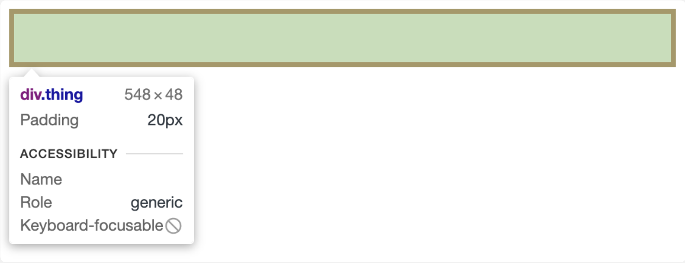

When we set out `.box` to have `width: 100%`, we're saying that the box's **content size** should be equal to the available space, `500px`. The padding and border is *added on top*.

The box winds up being `548px` wide because it adds `20px` of padding and 4px of border to each side: `500 + 20 * 2 + 4 * 2`.

The same thing happens with height: because the element is empty, it has a content size of `0px`, with the same border and padding added on top.

This behavior is surprising, and generally not what we want as developers! Thankfully, browsers provide an escape hatch.

The `box-sizing` CSS property allows us to change the rules for size calculations. The default value (`content-box`) only takes the inner content into account, but it offers an alternative value: `border-box`.

With `box-sizing: border-box`, things behave **much** more intuitively.

Instead of having to remember to swap box-sizing on every layout element, we can set it as the deault value of *all* elements with this handy CSS snippet:

```css
*,
*::before,
*::after {
  box-sizing: border-box;
}
```

This is the very first rule in the **custom CSS reset**, and arguably the most important

#### Padding

A helpful way to think about padding is that it's "inner-space".

Imagine that you add a background color to an element with some padding:

```css
.some-fella {
  padding: 48px;
  background-color: tomato;
}
```

Because padding is on the inside, the padded area also receive the background color.

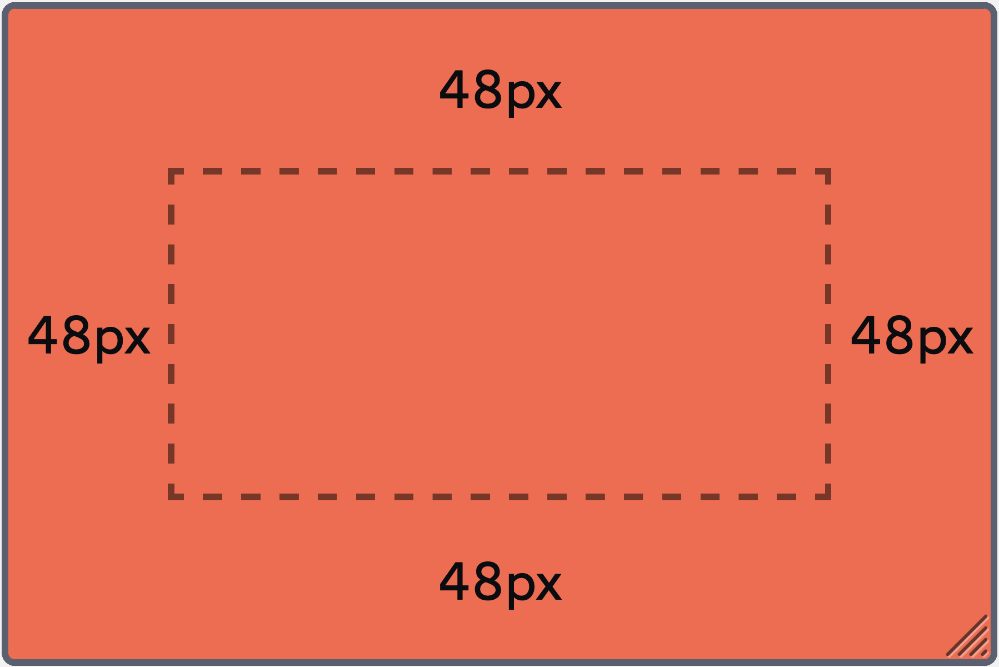

Padding can be set for all directions at once, or it can be specified for individual directions.

```css
.even-padding {
  padding: 20px;
}

.asymmetric-padding {
  padding-top: 20px;
  padding-bottom: 40px;
  padding-left: 60px;
  padding-right: 80px;
}

/* The same thing, but using ✨ logical properties ✨ */
.asymmetric-logical-padding {
  padding-block-start: 20px;
  padding-block-end: 40px;
  padding-inline-start: 60px;
  padding-inline-end: 80px;
}
```

pixels are the best units to use for padding, but are bad when it comes to *font-size*.

We can use percentages for padding:

```css
.box {
  padding-top: 25%;
}
```

We can, but the result is surpsiing and counter-intuitive; **percentages are ALWAYS calculated based on the elements available width.**
This is true for left/right padding, and even for top/bottom padding!

#### Border

Border is a bit of an odd duck in the trinity of padding/border/margin - unlike the other two, it has a **visual/cosmetic** component.

There are 3 styles specific to border:

* Border with (eg. `3px`, `1em`)
* Border style (eg. `solid`, `dotted`)
* Border color (eg. `hotpink`, `black`)

They can be combined into a shorthand:

```css
.box {
  border: 3px solid hotpink
}
```

The **only** required field is `border-style`. Without it, no border will be shown!

```css
.not-good {
  /* 🙅‍♀️ Won't work – needs a style! */
  border: 2px pink;
}

.good {
  /* 🙆‍♀️ Will produce a black, 3px-thick border */
  border: solid;
}
```

As with padding, you can overwrite broad properties with specific ones. 
This is useful for creating several "variants" of an element.

**Here's a fun fact:** If we don't specify a border color, it'll default to using the element's text color!

```html
<style>
  .box {
    /* No border color specified: */
    border: 4px solid;
  }
  .box.one {
    /* Specify the *text* color: */
    color: hotpink;
  }
  
  .box.two {
    color: slateblue;
  }
</style>

<div class="box one">One</div>
<div class="box two">Two</div>
<div class="box three">Three</div>
```

If you want to specify this behaviour explicitly, it can be done with the special currentColor keyword.

`currentColor` is always a reference to the element's derived text color (whether set explicitly or inherited), and it can be used anywhere a color might be used:

```css
.box {
  color: hotpink;
  border: 1px solid currentColor;
  box-shadow: 2px 2px 2px currentColor;
}
```

##### Border Radius

It's not hard to understand the rationale; the `border-radius` property **rounds** an element even if it has no border!

Like padding, `border-radius` accepts discrete values for each direction.
→ Unlike padding, it's focused on specific corners, not specific sides. Here are some examples:


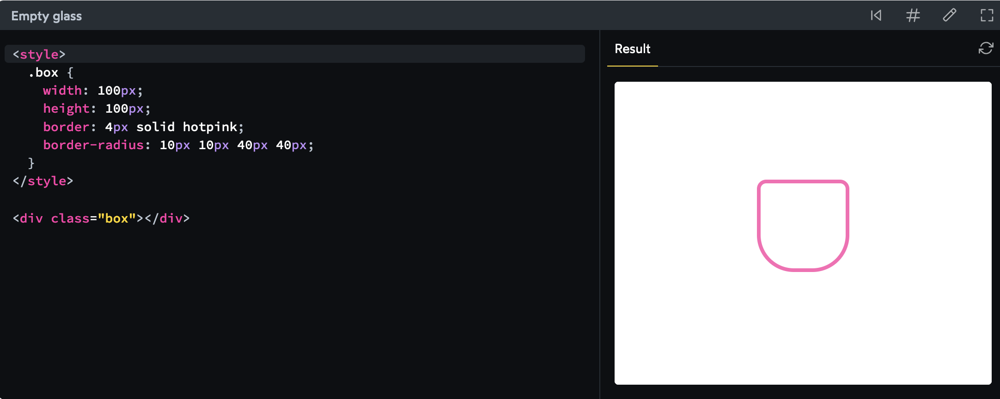

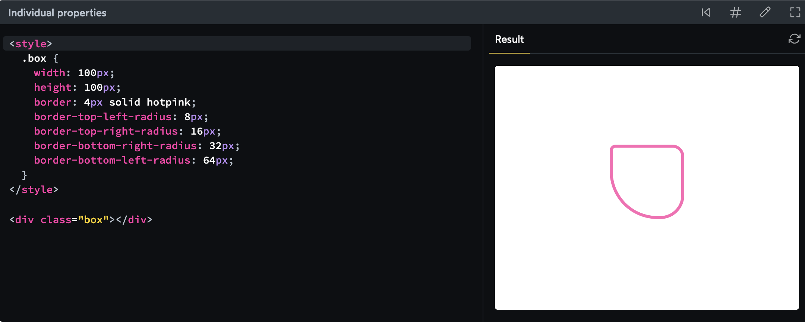

> You can also use percentages; 50% will turn your shape into a circle or oval, since each corner's radius is 50% of the total width/height:

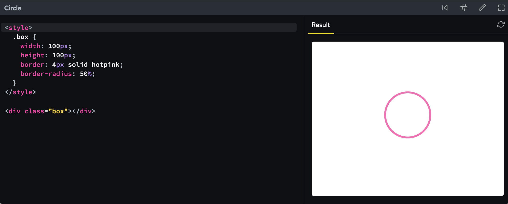

##### Border vs Outline

A common stumbling block for devs is the distinction between outline and border.

In some respects, they're quite similar! They both add a visual edge to a given element.

The **core difference** is that outline doesn't affect layout.

Outline is kinda more like `box-shadow`; it's a cosmetic effect draped over an element, without nudging it around, or changing its size.

Outlines share many of the same properties:

↪ border-width becomes outline-width
↪ border-color becomes outline-color
↪ border-style becomes outline-style

Outlines are stacked outside border, and can sometimes be used as a "second border", for effect:

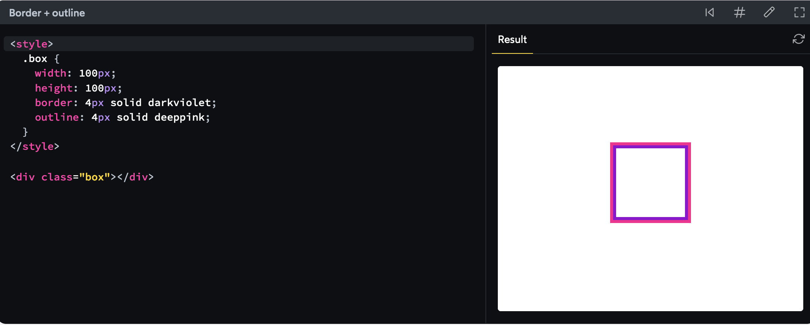

More tidbits about outlines:

↪ Outlines will follow the curve set with `border-radius` in all modern browsers. This is a relatively recent change, which landed in browsers between 2021 and 2023 

↪ **Outlines have a special `outline-offset` property.** It allows you to add a bit of a gap between the element and its outline

#### Margin

The third in the trinity: ***margin***.

Margin increase the space **around** an element, giving it some breathing room. As we saw earlier, margin is "personal space".

In some ways, margin is the most amorphous and mysterious. It can do wacky things, like pull an element outside a parent, or center itself within its container.

##### Syntax

The syntax for margin looks an awful lot like padding:

```css
.spaced-box {
  margin: 20px;
}

.asymmetrically-spaced-box {
  margin: 20px 10px;
}

.individually-specified-box {
  margin-top: 10px;
  margin-left: 20px;
  margin-right: 30px;
  margin-bottom: 40px;
}
.logical-box {
  margin-block-start: 20px;
  margin-block-end: 40px;
  margin-inline-start: 60px;
  margin-inline-end: 80px;
}
```

##### Negative margin

With padding and border, **only** positive numbers (including 0) are supported. With margin, however, we can drop into the negatives.

A negative margin can **pull** an element outside its parent or it can also pull an element's sibling closer:

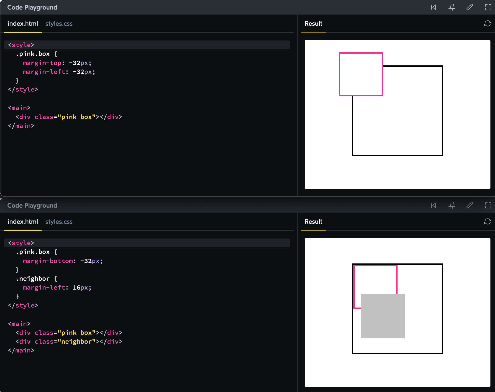

Interesting, right? The top `.pink.box` has a negative bottom margin, and the result is that its sibling is **pulled up**, and overlaps the pink box.

→ It's easy to fall into the trap of thinking that margin is exclusively about changing the selected element's position.
→ Really, though, it's about changing the gap between elements.
→ Negative margin shrinks the gap below an element, causing the next element to scoot up closer.

Negative margin can affect the position of **all siblings**. This is what happens if negative margin is applied to only the first box

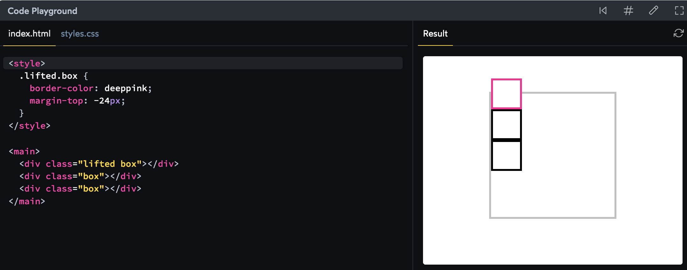

The interesting thing is those two black boxes: **they "follow" the deep pink box up**.

↪ When we use margin to tweak an element's position, **we might also be tweaking every subsequent element as well**.

↪ This is different from other methods of shifting an element's position, like using `transform: translate`.

##### Auto Margins

Margins have one other trick: they can be used to center a child in a container.

This is what happens when an element's left and right margin are set to `auto`.

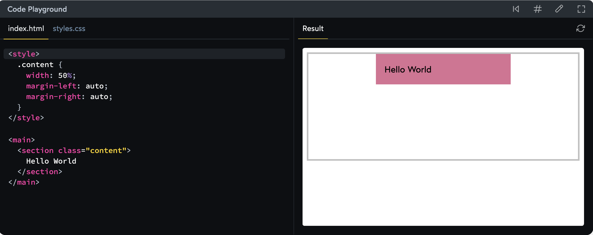

If we inspect this element in the devtools, the browser shows that it has applied an equal amount of margin on either side of the element:

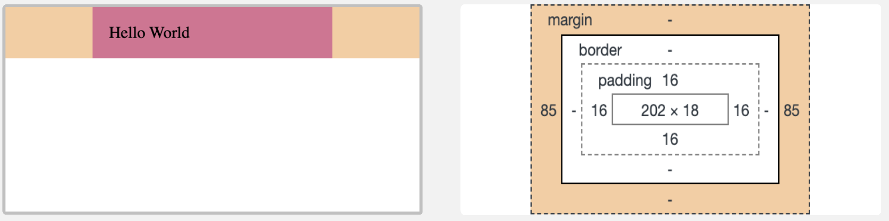

→ The `auto` value seeks to fill the ***maximum available space***. It works the same way for the `width` property.

→ When we set both `margin-left` and `margin-right` to `auto`, we're telling them each to take up as much space as possible.

→ Like a game of Hungry Hungry Hippos, both sides try to gobble up all of the free space around the element.

  ↪ They're evenly-matched, though, so neither side wins; they always end in a draw.

→ If you take the free space around an element and distribute it evenly on both sides, you wind up centering that element. This is a happy byproduct of this mechanism.

Two caveats:

→  This only works for **horizontal margin**.
&nbsp; &nbsp; ↪ Setting top/bottom margin to auto is equivalent to setting it to 0px

→ This only works on elements with an explicit width.
&nbsp; &nbsp; ↪ Block elements will naturally grow to fill the available horizontal space, so we need to give our element a width in order to center it.

###### Exercise

In Flow layout, elements are stacked neatly into boxes. Things don't overlap by default.

Sometimes, though, we want to pull something a little outside its parent container, for aesthetic effect.

The goal is to reproduce this image:

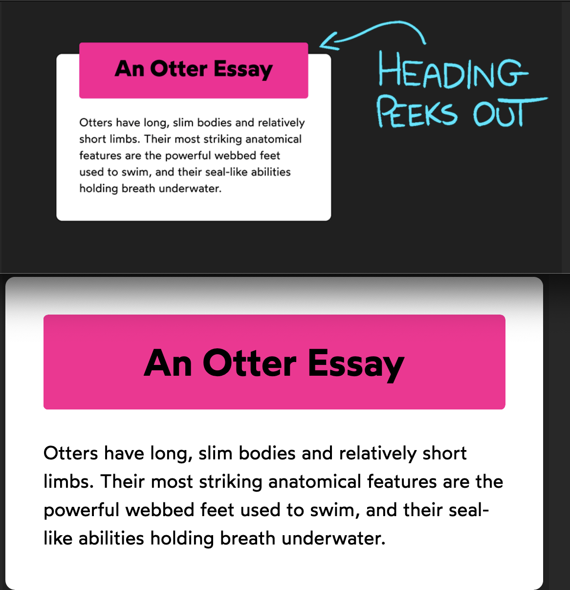

```css
  body {
    background: #222;
    padding: 32px;
  }

  .card {
    background-color: white;
    padding: 32px;
    border-radius: 8px;
  }

  h1 {
    background: deeppink;
    padding: 16px 32px;
    margin-bottom: 24px;
    font-size: 2rem;
    text-align: center;
    border-radius: 4px;
  }
```

Given the provided CSS, we know that we're going to have to play with negative-margin.

We give it a random value to just get a baseline -> `margin-top: -15px;` And while we notice that it does decrease the amount of white space above the pink box, it also pulls up the sibling elements.

But that's fine, it's just a matter of figuring out how many pixels the pink box requires.

We notice that the values for `padding: 16px 32px;` and `margin-bottom: 24px;` are multiples of 8 and even the `padding` of the card: `padding: 32px;` is a multiple of 8.

This suggests that we should stay within a multiple of 8, which eventually will lead us to `margin-top: -48px;`

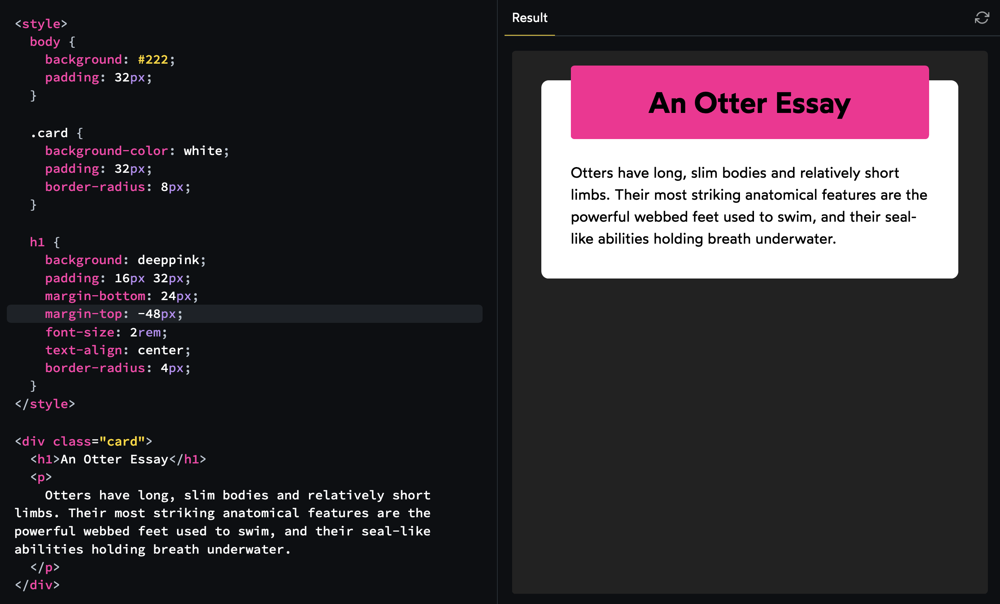

###### Exercise Part 2: Stretched Content

Our `.card` element has served us well so far, but if we want to include a picture of an otter, and we want it to stretch out, to fill the available container width:


The container's padding is getting in our way.

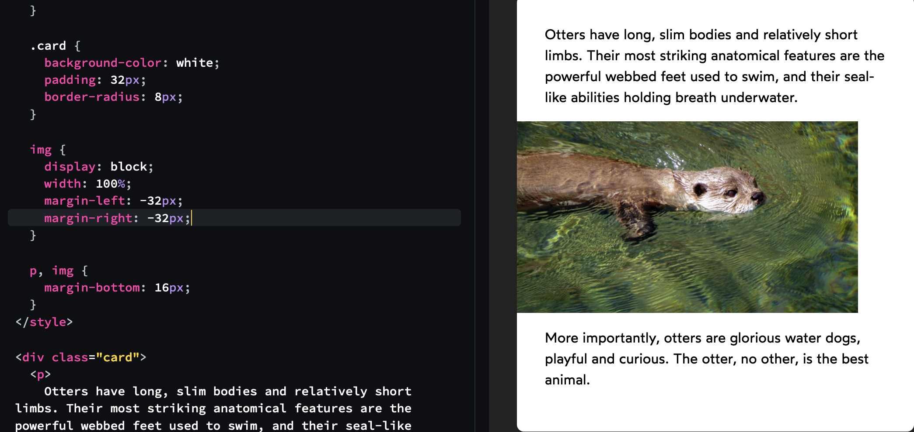

→ We've stretched the image but it seems to have only stretched to the left side and it's because of the `width: 100%` on the image.

→ Images are weird, they're replaced elements.

→ So the image itself isn't part of the DOM... It's kind of a foreign object that we're embedding in the DOM.

→ If we remove the width property all-together, the image takes up its natural size. 

An alternative is to use `calc`, but there is another way. **We can use a wrapping element**.

We wrap the `img` tag in a `div`, and that way the iamge fills that container. 

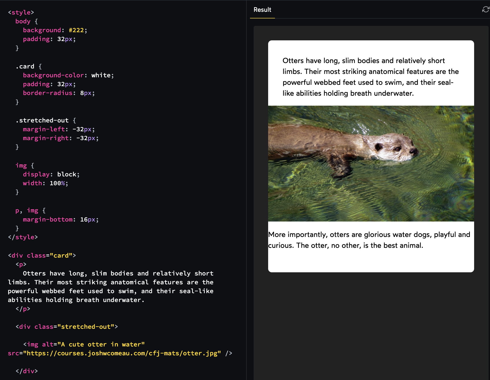

More explanation for the use of a **wrapping element**.

→ The default value for the `width` property is `auto`.
→ By default, for most elements, this means “automatically grow to fill as much space as possible”.

→ Images, as well as other “replaced elements” like `<video>` and `<canvas>`, are special.
→ They don't automatically expand to fill the available space.
&nbsp; &nbsp; ↪ Instead, they rely on their intrinsic size.

→ For example, suppose I take a photo on an old webcam. That photo has a native size of `640 × 480`.
&nbsp; &nbsp; ↪ When I embed this image on the page, using an `` tag, it'll have a default width of `640px`.

**This is the problem.** `width: auto` has a different meaning for replaced elements. It doesn't mean "stretch out and fill all of the space", it means "use your natural width"!

### Flow Layout

When it comes to layout, CSS is more like a collection of mini-languages than a single cohesive language.

Every HTML element will have its layout calculated by a layout algorithm. These are known as “*layout modes*”, and there are 7 distinct ones.

We'll cover several layout modes in this course, including:
 
1. Positioned layout
2. “Flexible Box” layout (AKA Flexbox), and 
3. Grid layout (AKA CSS Grid)
 
For now, though, let's focus on Flow layout.

Flow layout is the default layout mode. Everything we've seen so far has used Flow layout.
A plain HTML document, with no CSS applied, uses Flow layout exclusively.

I like to think of Flow layout as the “Microsoft Word” layout algorithm. It's intended to be used for document type layouts.

There are two main element types in Flow layout:

→ **Block elements:** things like headings, paragraphs, footers, asides. The chunks of content that make up a page

→ **Inline elements:** things like links, or a string of bold text. Generally inline elements are meant to highlight bits of text, or elements within a block container.

Each HTML tag has a default type. `<div>` and `<header>` are block elements, `span` and `<a>` are inline elements.

We can toggle any particular element with the `display` property:

```css
/* Transform a particular <a> tag from `inline` to `block`: */
a.nav-link {
  display: block;
}
```

There's also a third value, `inline-block`, which is a sort of fusion between the two types.

In flow layout, block elements stack in the block direction, and inline elements stack in the inline direction.

It's more than just direction, though. Each `display` value comes with its own behaviour, its own rules.

##### Inline elements don't want to make a fuss

If you've ever tried to adjust the positioning or size of an inline element, you've likely been confounded by the fact that a bunch of CSS properties just don't work.

For example, this snippet will have no effect:

```css
strong {
  height: 2em;
}
```

You can picture inline elements as go-with-the-flow-type folks.
They don't want to inconvenience anyone by pushing any boundaries.

You *can* shift things in the inline direction with `margin-left` and `margin-right`, since that pushes it around in the inline direction, but you can't give it a `width` or `height`.

When it comes to layout, an inline element is where it is, and there's not much we can do about it.

> Replaced elements, `img`, `video`, `canvas` are technically inline, but they're special: they can affect block layout.


##### Block elements don't share

When you place a block level element on the page, its content box greedily expands to fill the entire available horizontal space.

A heading might only need `150xp` to contain its letters, but if you put it in an `800px` container, it will expand to fill `800px` of width.

If we want to shrink the container to the minimum size required for the letters, we can do this with the special `width` keyword `fit-content`.

```html
<style>
  h2 {
    width: fit-content;
    border: 2px dotted;
  }

  .box.red {
    width: 50px;
    height: 25px;
    background: red;
  }
</style>

<h2>
  Hello World
</h2>
<div class="box red"></div>
```

There will be plenty of space left on that first row, regardless the `h2` will sit underneath the heading. 

`h2` does not want to share any inline space.

In other words, elements that are `display: block` will stack in the block direction, regardless of their size.

##### Inline elements have "magic space"

In the box model lesson, we saw 3 ways to increase sapce around an element.

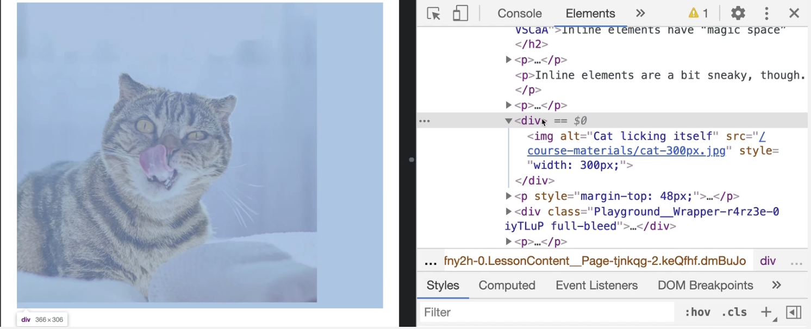

The image is 300px tall, but the parent div is 306px tall. The extra pixels are called "magic space" because the browser treats inline elements as if they're typography. 

It makes sense that with text, you'd want a bit of extra space, so that the lines in a paragraph aren't crammed in too tightly.


There are 2 ways to fix this:

1. Set images to `display: block` - if you're noticing this problem, there's a good chance your images aren't interspersed with text, so setting them to display as blocks makes sense.
2. Set the `line-height` on the wrapping div to `0`.

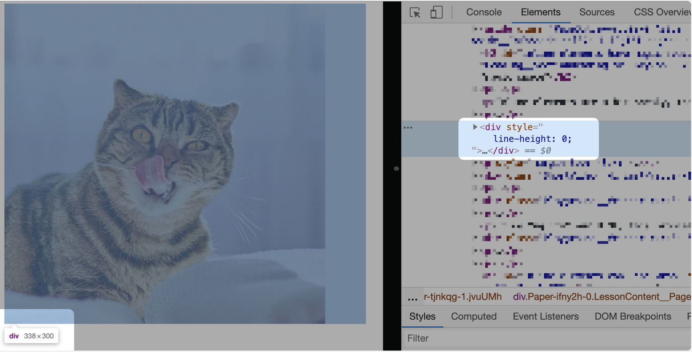

This space is proportional to the height of each line, so if we reduce the line height to 0, this "magic space" goes away.
Because our container doesn't contain any text, this property has no other effect.

###### Space between inline elements

HTML is *space-sensitive*, at least to an extent. The browser can't tell the difference between whitespace added to separate words in a paragraph, and whitespace added to indent our HTML and keep it readable.

This problem is specific to Flow-layout. Other layout modes, like Flexbox, ignore whitespace altogether. So, the simplest thing is to switch the container to use Flexbox.

Inline elements can also line-wrap. 

##### The deal with inline-block

Most confusing things about Flow layout is the Frankenstein `display: inline-block` value.

An `inline-block` element is a block-level element that can be placed in an inline context. We can think of `inline-block` as "a block in inline's clothing".

In terms of layout, it's treated as an inline element. We can drop it in the middle of a paragraph, without totally borking the layout. But *internally*, it acts much more like a block element.

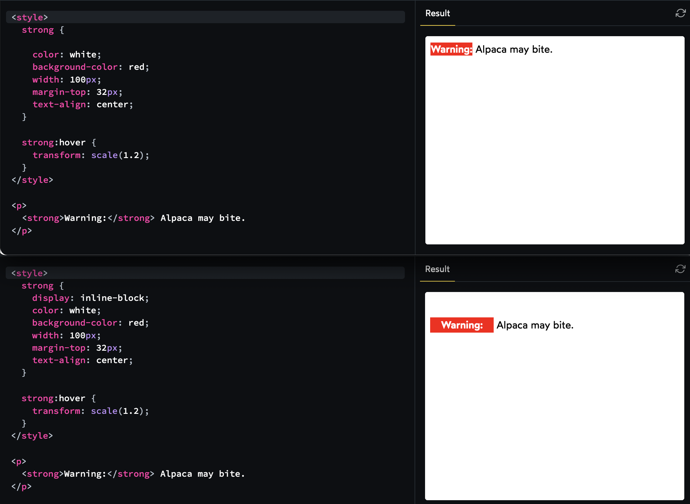

The first image demonstrates when `strong` doesn't have the property `display: inline-block`.

While the second demonstrates what it looks like with the property applied.

This element now has access to the *full universe* of CSS. Usually, properties like `width` and `margin-top` have no effect on an **inline element**, but they *do* work on **inline-block** elements.

We've effectively turned out `strong` element into a block element, as far as its **own** CSS declarations are concerned.

But from the paragraph's perspective, it's an inline element. It lays it out as an inline element, in the inline direction beside the text.

In many ways, `inline-block` allows us to have our cake and eat it too.

However, `inline-block` doesn't line-wrap.

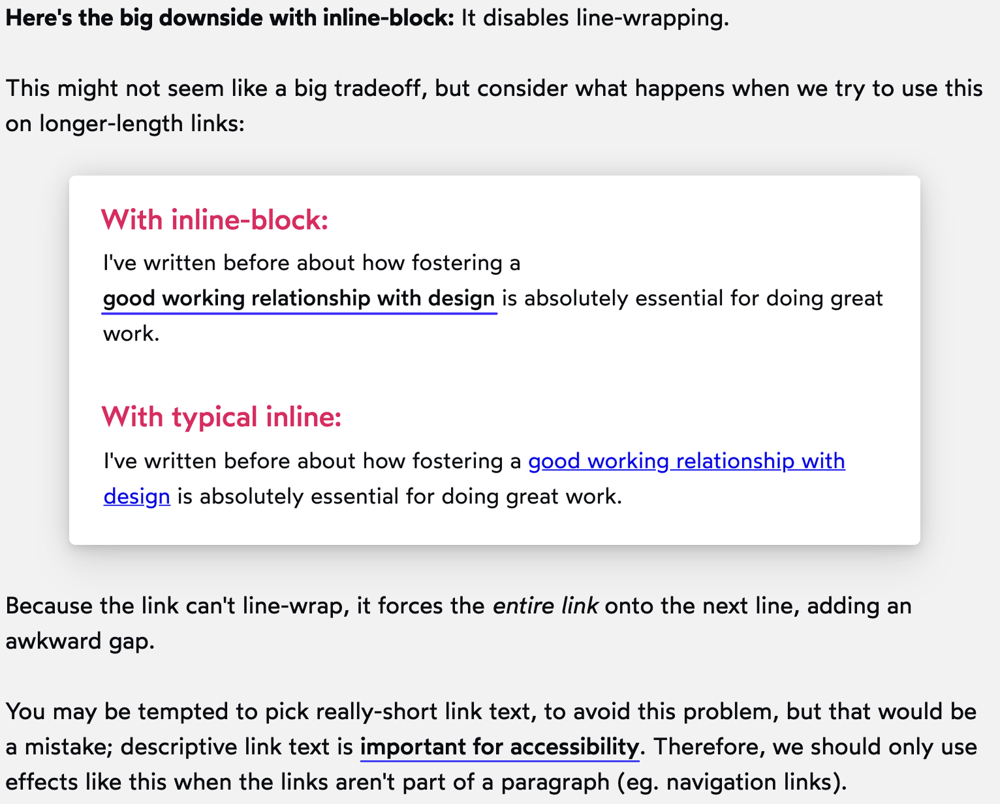

#### Width Algorithms

Block-level elements like `h1` and `p` will expand to fill the available space.
↪ that doesn't mean that they have a default `width` of 100%, but that wouldn't be quite right.

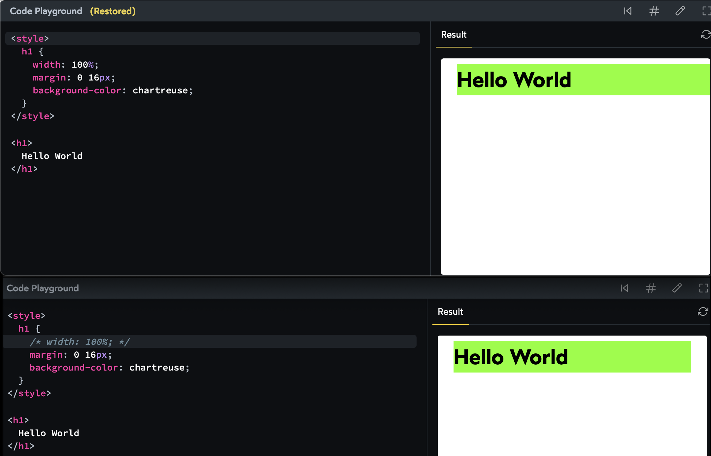

Notice how enabling `width: 100%`, we cause the heading to pop outside of our frame. This happens because of the margin.

When percentage-based widths are used, those percentages are **based on the parent element's content space**.

If the `body` tag makes 400px of space available, any child with 100% width will become 400px wide, regardless of any other circumstances.

Block elements have a default `width` value of `auto`, not `100%`. `width: auto` works very similar to `margin: auto`; it's a hungry value that will grow as mich as its able to, but no more.

In the case above, the `h1` will grow to consume (100% - 32px), since there is 16px of margin on either side.

It's a subtle but **important distinction:** by default, block elements have *dynamic sizing*.
They're context aware.

##### Keyword values

There are two kinds of values to specify for width:

1. Measurements (100%, 200px, 5rem)
2. Keywords (auto, fit-content)

Measurement-based values are either completely explicit (eg. 200px), or relative to the parent's available space (eg. 50%).
Keywords, on the other hand, let us specify different sorts of behaviours depending on the context.

We've already seen how `auto` will let our element greedily consume the available space while respecting any constraints.

##### min-content

When we set `width: min-content`, we're specifying that we want our element to become as narrow as it can, *based on the child contents*.
This is a totally different perspective: we aren't sizing based on the sapce made available by the parent, we're sizing based on the element's children!

This value is known as an *instrinsic value*, while measurements and the `auto` keyword are *extrinsic*. The distinction is based on whether we're focusing on the element itself, or the element's children!

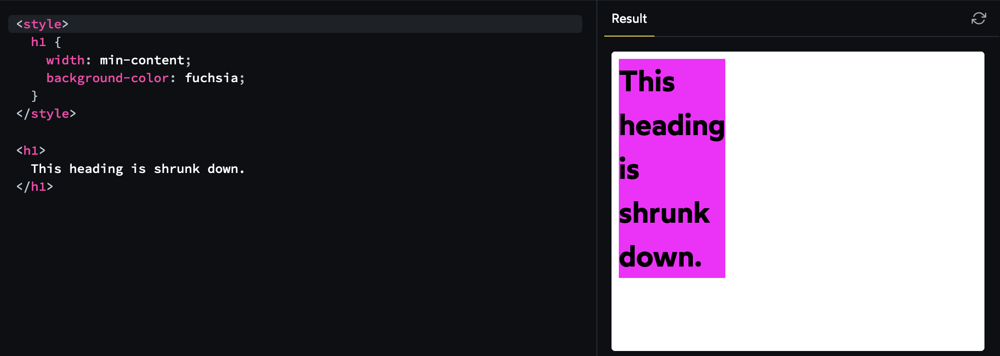

In this case, we wind up with a *very* narrow heading, because it chooses the smallest possible value for `width` that still contains each word. Whenever it encounters whitespace or a hyphenated word, it'll break it onto a new line.

This value can be useful for certain kinds of effects.

##### max-content

This value is similar in principle, but it takes an opposite strategy: it *never* adds any line-breaks.

The element's width will be the smallest value that contains the content, without breaking it up:

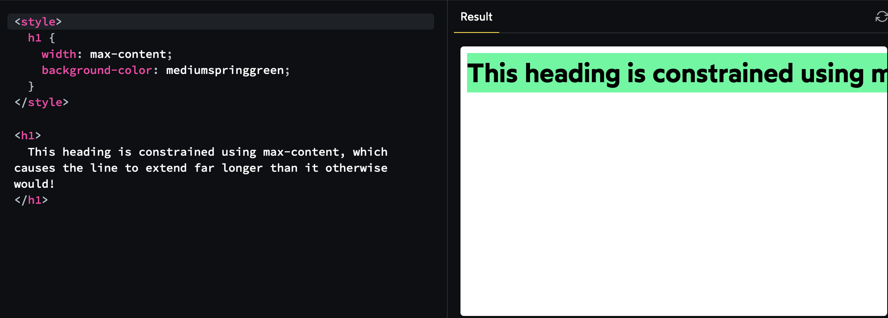

As you can see, an element with `width: max-content` pays no attention to the constraints set by the parent. It will size the element based purely on the length of its unbroken children.

Why would this be useful? Well, its produces a nice effect when the content is short enough to fit within the parent.

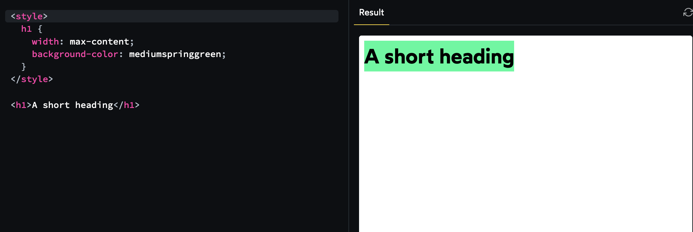

Unlke with `auto`, `max-content` doesn't fill the available space. If we want to add a background color *only* around the letters, this would be a neat way to do it!

Of course, our work needs to render correctly across screens of all sizes. We can't assume that the container will always be big enough to contain the heading! 

Thankfully, one more value is provided by the browser...

##### fit-content

If these keywords were bowls of porridge, `fit-content` would be the one that Goldilocks declares "just-right".

Here's how it works: like `min-content` and `max-content`, the width is based on the size of the children. If that width can fit within the parent container, it behaves just like `max-content`, not adding any line-breaks.

If the content is too wide to fit in the parent, however, it adds line-breaks as-needed to ensure it never exceeds the available space. It behaves just like `width: auto`.

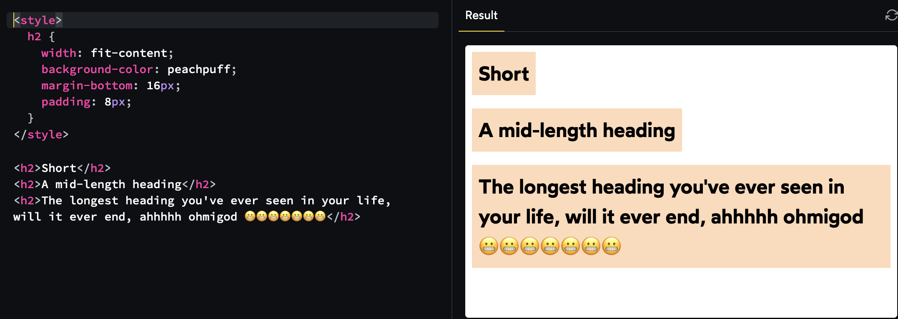

##### Min and max widths

We can add constraints to an element's size using `min-width` and `max-width`

```html
<style>
  h2 {
    width: fit-content;
    background-color: peachpuff;
    margin-bottom: 16px;
    padding: 8px;
  }
</style>

<h2>Short</h2>
<h2>A mid-length heading</h2>
<h2>The longest heading you've ever seen in your life</h2>
```

The particularly exciting thing about `min-width` and `max-width` is that they let us *mix units*.
We can specify constraints in pixels, but set a percentage `width`.

#### Height Algorithms

We've seen how widths are calcualted in Flow layout. Setting an element to have a height of `50%` will force that item to take up half of the parent element's content area: no more, no less.

In other ways, they're quite different.

The default "width" behaviour of a block-level element is to fill all the available width, whereas the default "height" behaviour is to be as small as possible while fitting all of the element's content; it's closer to `width: min-content` than `width: auto`!

Also, we tend to treat height as "more dynamic" than width.

We might feel comfortable setting our main content wrapper to have a max width of 750px, but we wouldn't usually do this with height;

We want our design to work whether the content is 200 words, or 20,000 words.

And even for pages with the exact same content, we expect that our containers will grow taller on phone screens, and shorter on desktop monitors.

We generally want to **avoid** setting fixed heights, otherwise we might wind up in a sticky situation.

However, setting a minimum height, is a different story...

For example, let's say that we have an element that wraps around our entire app.
If a specific page doesn't have much content, the entire app might be less than 100% of our window height.

What if we **want** it to take up at least 100% of the available space?

**Have you ever tried to use a percentage-based height, only to discover that it seems to have no effect?**

The default behavior of an element in terms of height is to be as small as possible, to contain its children.

Our `section` sits inside the `<body>` tag, and so when we set a percentage-based height or `min-height`, the percentage is based on that parent height. `<body>` doesn't have a specific height set, which means it uses the default behaviour: stay as short as possible, while still containing all the children.

In other words, we have an impossible condition: we're telling the `<section>` to be a percentage of the `<body>`, and the `<body>` wants to base its size off of the `<section>`.
They're both looking to each other for guidance.

**This is a reall common source of confusion.** It isn't fixed by Flexbox or Grid, either; those tools help us control the contents of a container, but that container still needs to get its height from somewhere!

Here's how to fix it:

→ Put `height: 100%` on every element before your main one (including `html` and `body`)

→ Put `min-height: 100%` on that wrapper

→ Don't try and use percentage-based heights within that wrapper

When `html` is given `height: 100%`, it takes up the height of the viewport. That serves as our based. The `body` tag's 100% is based on that base size.

When we get to our wrapper, we want to use `min-height`. This way, the minimum size is equal to the viewport height, but it can overflow and take up more space if required by the content.

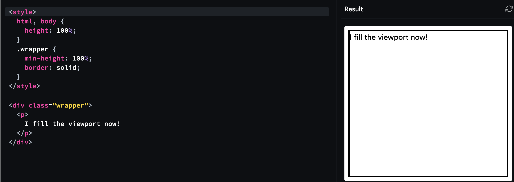

**By default, width looks UP the tree, while height looks DOWN the tree**.
An element's **width** is calculated based on its ***parent's size***, but an element's **height** is calculated based on its ***children***.

When it comes to height, a parent element will "shrinking wrap" itself around its children, like a pouch of vacuum-sealed food.

We can override this default behavior by specifying an explicit value. For example, `width: 300px` and `height: 500px` don't look up or down the tree; they don't have to calculate anything, since we're giving it a specific value! 
So, I'm specifically talking about when we *don't* set `width`/`height`.


> What about the **vh** unit ?
> The **vh** unit was designed exactly for this purpose.
> If you set `height: 100vh`, your element will inherit its height from the viewport size.
> Although useful, `vh` is not mobile friendly just yet. So stick to 100% for now.

### Margin Collapse

#### Intro to Margin Collapse

Margin is akin to "personal space", and let's suppose that we want to keep 6 feet* of personal space.

Those 6 feet can be "shared", if each person has a 6-foot bubble, we don't actually need to be 12 feet away

Margins work in a similar fashion -- adjacent margins will sometimes "collapse", **and overlap**

<hr>

Margin has this tricky thing, unlike padding and border, **it is possible for margin to overlap**

So you have 2 paragraphs, one on top of the other
And each of those paragraphs wants to have 20px of margin (20px of space).

IF you just put them one on top of the other, you're not going to get 40px between them, you're going to get 20

  -> because the 2 paragraphs are going to share that margin space **AND** this is called **margin collapsing**

> It's the idea that when you have margins that are side by side, they collapse into one space

This sounds simple, but there a lot of little conditions and edge cases that make it actually really hard to develop an intuition for, if you just wing it, taking a little bit of time to familiarize yourself with these rules makes things so much easier, and so much more intuitive

We're going to develop an intuition for how margins collapse when they do and dont. 

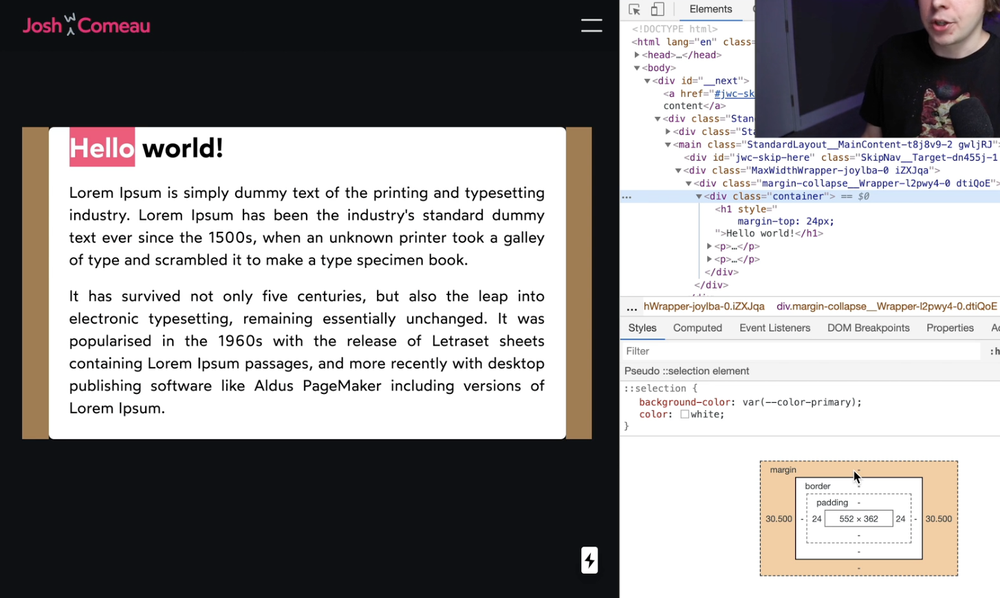

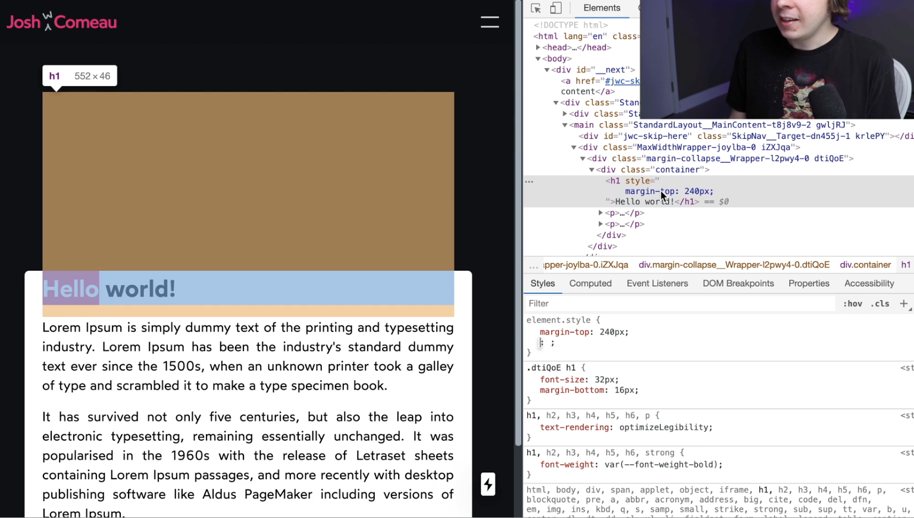

Both these images illustrate another instance of margin-collapse.

While `margin: 240px` was placed on the `h1` tag, there was no space between the heading and the white container. Instead it pushed the entire paragraph down.

#### Rules of Margin Collapse

To really understand margin collapse, we need to consider a lot of different circumstances.

Let's go through them one by one, looking at how different situations lead to different results.

**This can be a lot to take in**

##### Only Veritcal Margins Collapse

```html
<style>
  p {
    margin-top: 24px;
    margin-bottom: 24px;
  }
</style>

<p> Paragraph One </p>
<p> Paragraph Two </p>
```

Each paragraph has `24px` of vertical margin (`margin-top` and `margin-bottom`), and that margin collapses.
The paragraphs will be 24px apart, not 48px apart.

*Hover over (or focus) this visualization*.

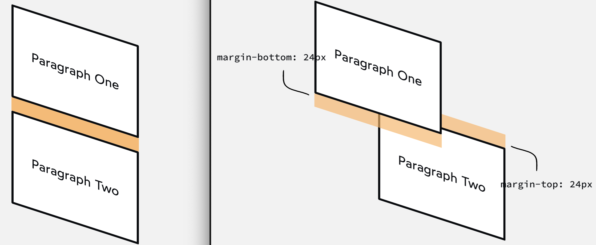

When margin-collapse was added to the CSS specification, the language designers made a curious choice: **horizontal margins (`margin-left` and `margin-right`) shouldn't collapse**

In the early days, CSS wasn't intended to be used for layouts. The people writing the spec were imaginging headings and paragraphs, not columns and sidebars.

**So that's our first rule: *only vertical margins collapse* **

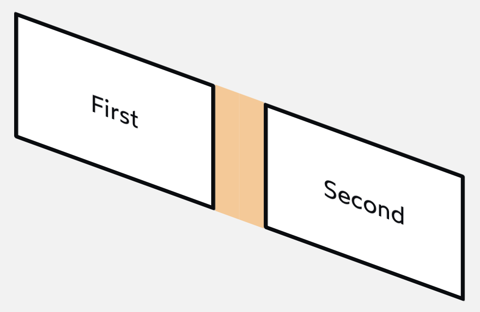

> CSS gives us the power to switch our writing modes, so that block-level elements stack horizontally instead of vertically.
> What effect do you think this would have on margin collapse?

```html
<style>
  html {
    writing-mode: vertical-lr;
  }

  p {
    display: block;
    margin-block-start: 24px;
    margin-block-end: 24px;
  }
</style>

<p>Paragraph 1</p>
<p>Paragraph 2</p>
```

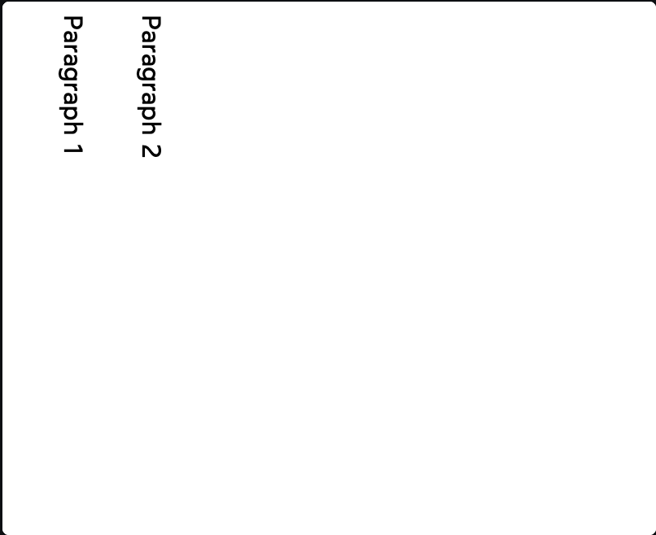

When **block** elements are stacked horizontally, this rule flips: **now**, horizontal margins collapse, **but** vertical margins don't.

So our first rule is a bit of a misnomer;
it would be more accurate to say that **only block-direction margins collapse**.

Vertical text on the web is relatively rare.

It's important to recognize that English is not the universal language of the web, but almost all web languages are written either from left-to-right, or right-to-left.

##### Margins only collapse in Flow layout

The web has multiple layout modes, like **positioned layout**, **flexbox layout**, and **grid layout**.

Margin collapse is *unique* to **Flow Layout**. If you have children inside a `display: flex` parent, those children's margins will never collapse.

##### Only adjacent elements collapse

It is somewhat common to use the `<br />` tag to increase space between block elements

```html
<style>
  p {
    margin-top: 32px;
    margin-bottom: 32px;
  }
</style>

<p>Paragraph One</p>
<br />
<p>Paragraph Two</p>
```

**Regrettably**, this has an adverse effect on our margins:

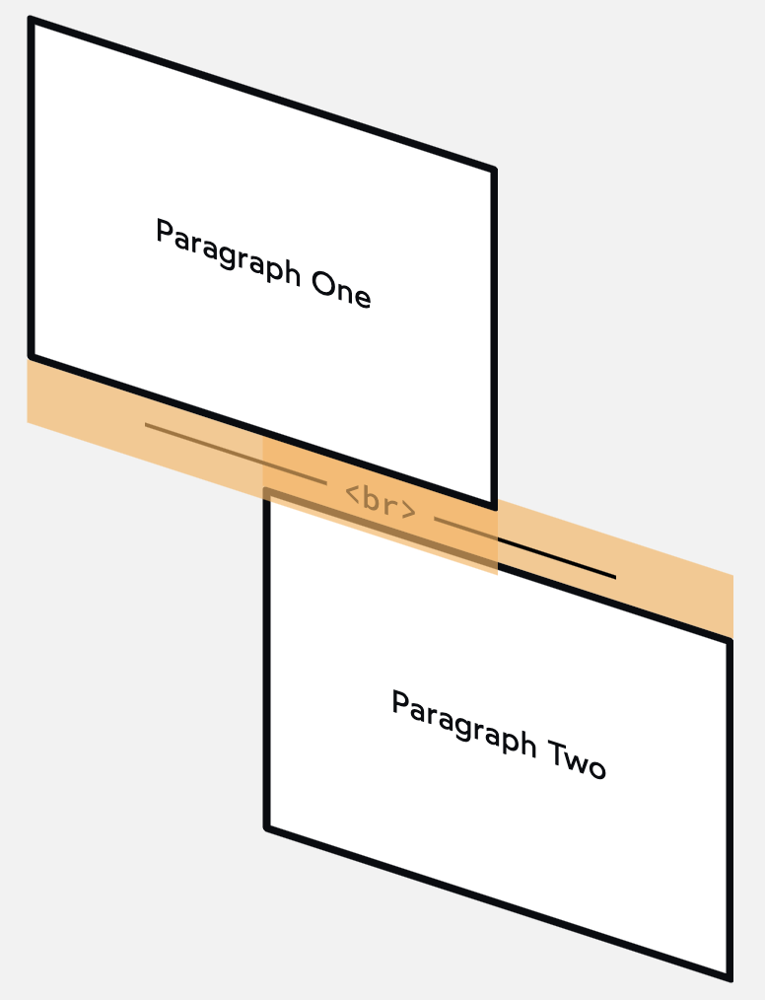

The `<br />` tag is invisible and empty, **but any element between two others will block margins from collapsing**. Elements need to be adjacent in the DOM for their margins to collapse.

And when the margins are asymmetrical... Say, the top element wants 72px of space below, while the bottom element only needs 24px, the bigger number wins.

##### Bigger margin wins

What about when the margins are asymmetrical? 
Say, the top element wants 72px of space below, while the bottom element only needs 24px?

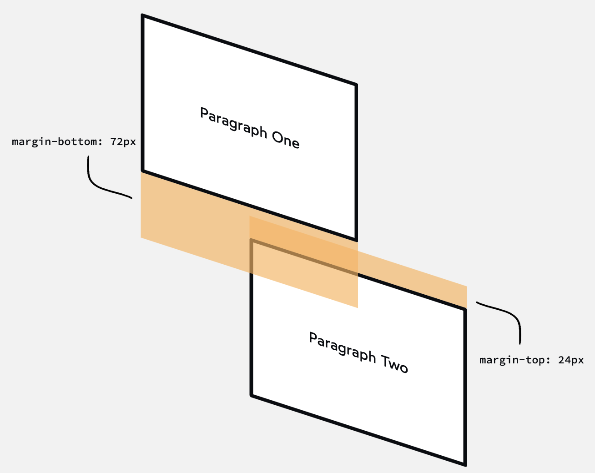

The bigger number wins.

This one feels intuitive if you think of margin as "personal space".

If one person needs 6 feet of personal space, and another requires 8 feet of personal space, the two people will keep 8 feet apart.

##### Nesting doesn't prevent collapsing

```html
<style>
  p {
    margin-top: 48px;
    margin-bottom: 48px;
  }
</style>

<div>
  <p>Paragraph One</p>
</div>
<p>Paragraph Two</p>
```

We're dropping our first paragraph into a containing `<div>`, but the margins will still collapse!

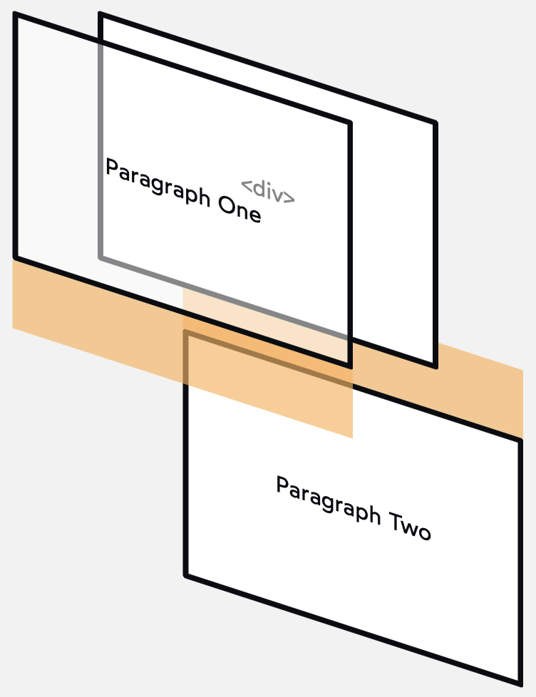

It turns out that many of us have a misconception about how margins work.

Margin is meant to **increase the distance between siblings**. 
It is **not meant to** increase the gap between a child and its parent's bounding box; **that's what padding is for**.

Margin will always try and increase distance between siblings, **even if it means transferring margin to the parent element**!

In this case, **the effect is the same** as if we had applied the margin to the parent `<div>`, not the child `<p>`.

“But that can't be!”, I can hear you saying. “I've used margin before to increase the distance between the parent and the first child!”

**Margins only collapse when they're touching**.
Here are some **examples** of nested margins that don't collapse.

##### Blocked by padding or border

You can think of padding/border as a sort of wall;
if it sits between two margins, they can't collapse, because there's an obstruction in the way

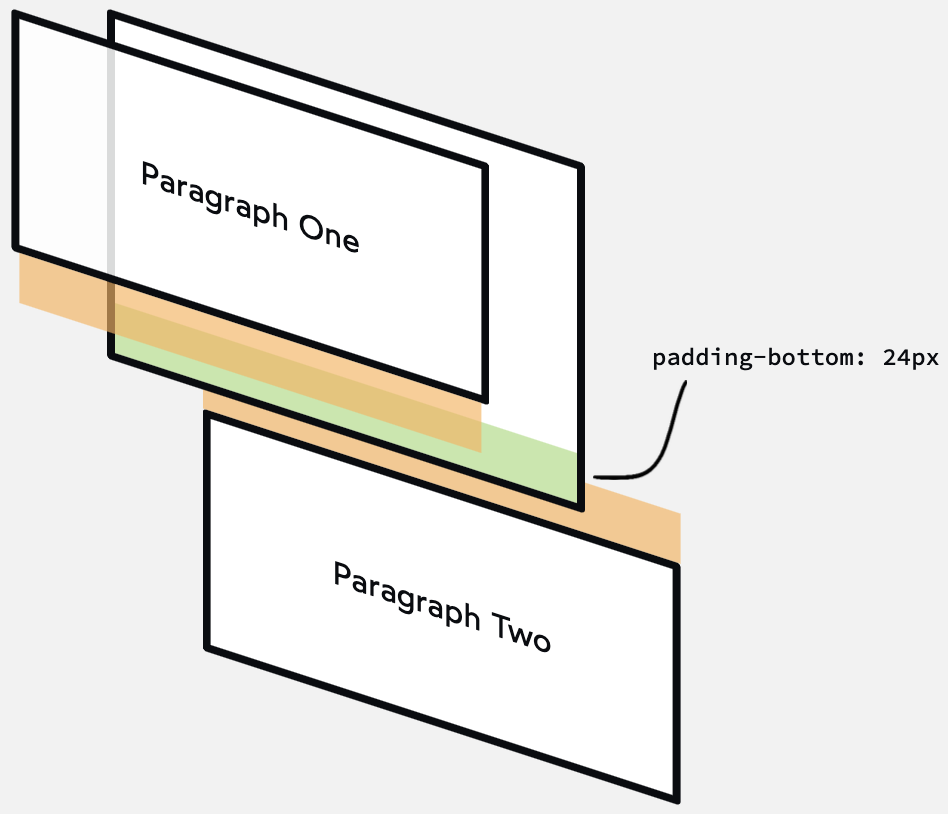

This image shows padding, but the same thing happens with border

Even `1px` of padding or border will cause margins not to collapse

##### Blocked by a gap

As we saw in Height Algorithms, a parent will "**Vacuum-Seal**"
around a child.
A 150px-tall single child will have a 150px-tall parent, with no pixels to spare on either side.

But what if we explicitly give our parent element a height?
Well, that would create a gap underneath the child:

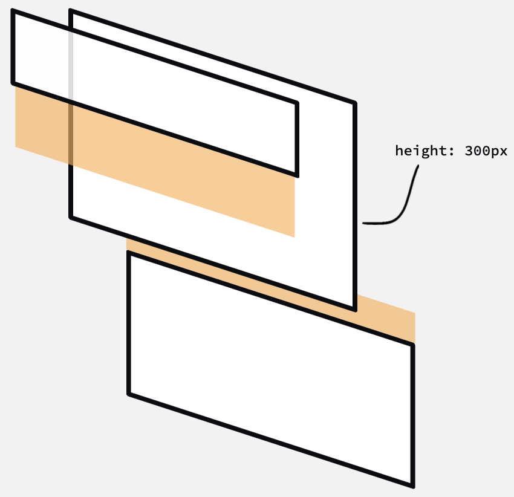

The empty space between the two margins stops them from collapsing, like a moat filled with hungry piranhas

Note that this is on a **per-side basis**.
In this example, the child's *top* margin could still collapse.
But because there's some empty space below the child, its bottom margin will never collapse

##### Blocked by a scroll container

The `overflow` property can **create a scoll container**
If the parent element creates a scroll container, with a declaration like `overflow: auto` or `overflow: hidden`, it will disable margin collapse if the margins are on either side of the scroll container

Here's the takeaway from these three scenarios: **Margins must be touching in order for them to collapse**

##### Margins can collapse in the same direction

So far, all the examples we've seen involve adjacent opposite margins: the bottom of one element overlaps with the top of the next element.

**Surprisingly, margins can collapse even in the same direction.**

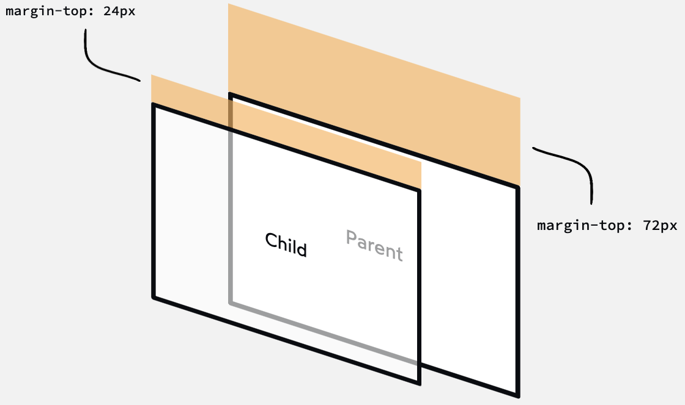

Here's the code for a margin collapse in the same direction.

```html
<style>
  .parent {
    margin-top: 72px;
  }

  .child {
    margin-top: 24px;
  }
</style>

<div class="parent">
  <p class="child">Paragraph One</p>
</div>
```


This is an extension of the previous rule. The child margin is getting "absorbed" into the parent margin.

The two are combining, and are subject to the same rules of margin-collapse we've seen so far (e.g the biggest one wins)

This can lead to big surprises. For example, check out this common frustration:

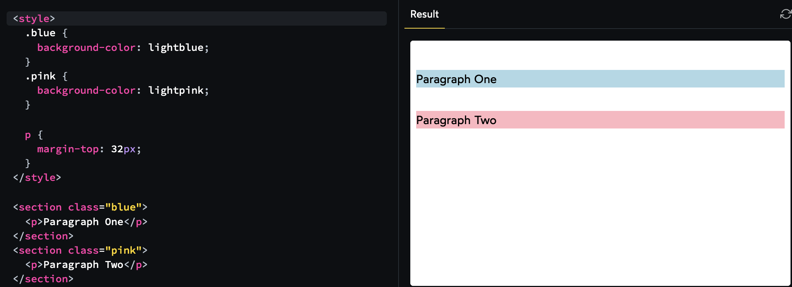

In this scenario, you might expect the two sections to be touching, with the margin applied inside each container:

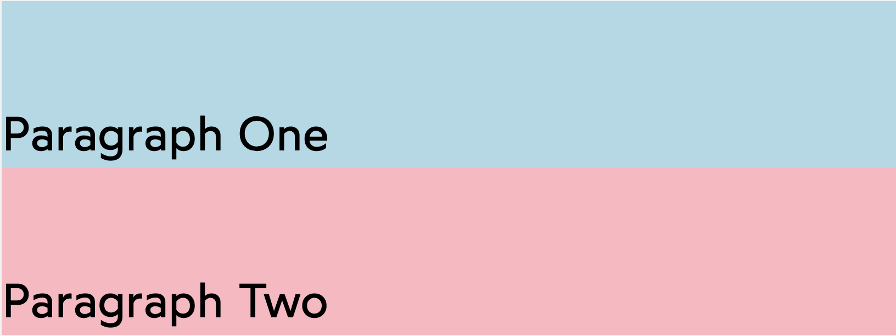

This seems like a reasonable assumption, since the `<section>`s have no margin at all!
The intention seems to be to increase the space within the top of each box, to give the paragraphs a bit of breathing room.

The trouble is that 0px margin is still a collapsible margin.
Each section has 0px top margin, and it gets combined with the 32px top margin on the paragraph.
Since 32px is the larger of the two, it wins.

##### Negative Margins

Finally, we have one more factor to consider: negative margins.
As we saw when we looked at Margins, a negative margin will pull an element in the opposite direction.

A sibling with a negative margin-top might overlap its neighbor:

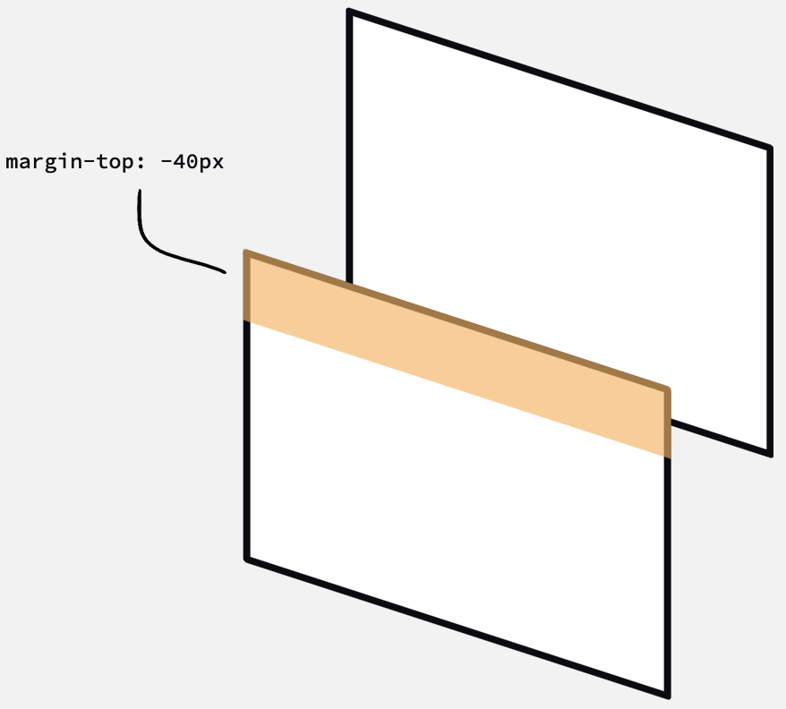

How do negative margins collapse?

Well, it's actually quite similar to positive ones!

The negative margins will share a space, and the size of that space is determined by the most significant negative margin.

In this example, the elements overlap by `75px`, since the more-negative margin `(-75px)` was more significant than the other `(-25px)`.

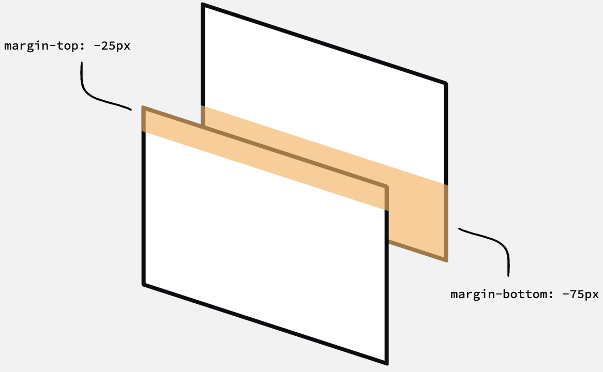

What about when negative and positive margins are mixed?

In this case, the numbers are added together. In this example, the -25px negative margin and the 25px positive margin cancel each other out and have no effect, since -25px + 25px is 0.

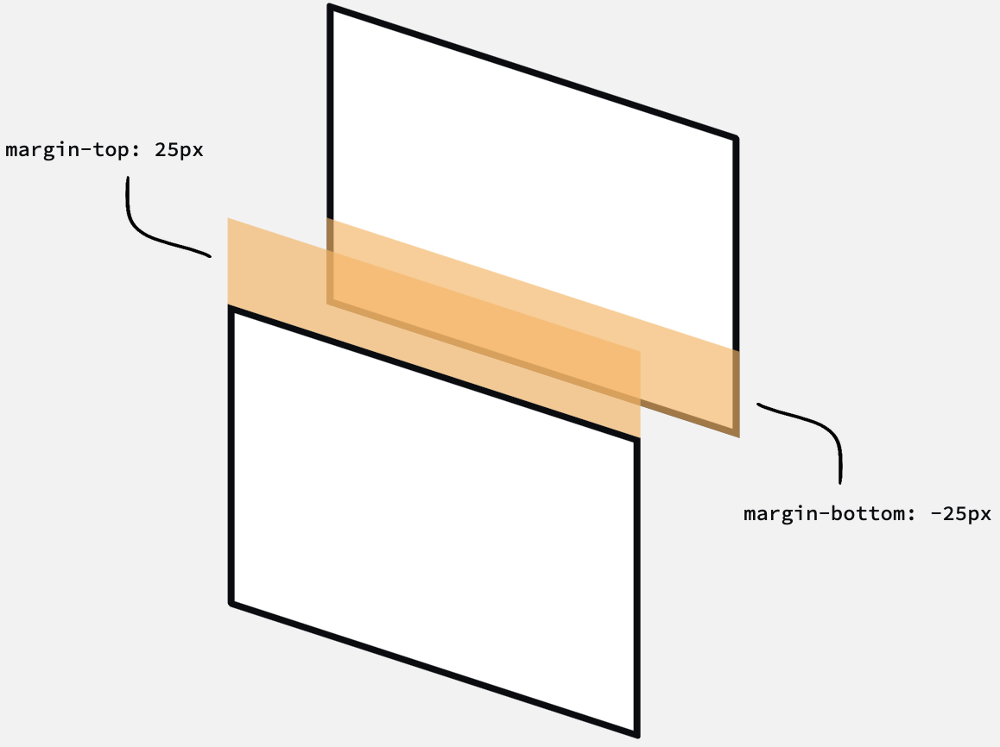

Why would we want to apply margins that have no effect?! 

Well, sometimes you don't control one of the two margins.
Maybe it comes from a legacy style, or it's tightly ensconced in a component.
By applying an inverse negative margin to the parent, you can "cancel out" a margin.

Of course, this is not ideal. Better to remove unwanted margins than to add even more margins! But this hacky fix can be a lifesaver in certain situations.

#### Will It Collapse ?

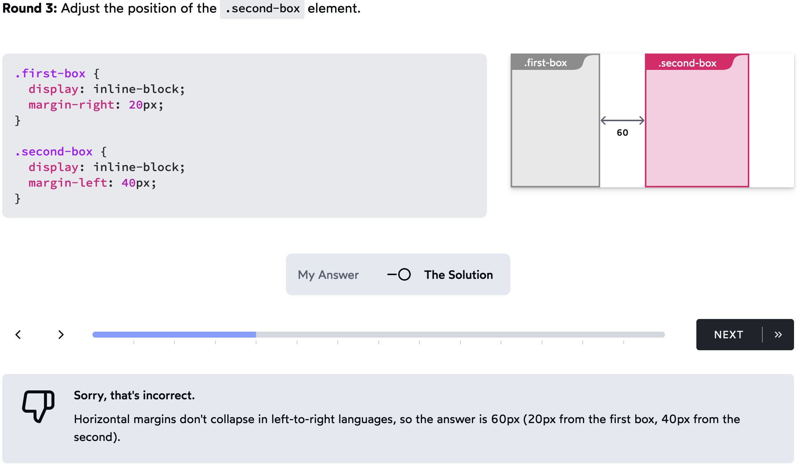


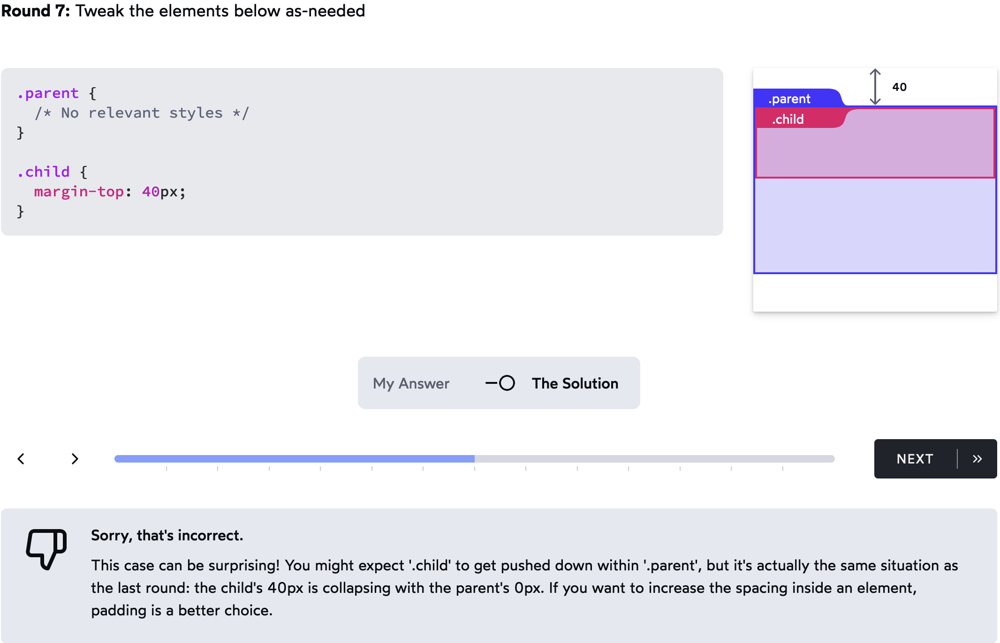

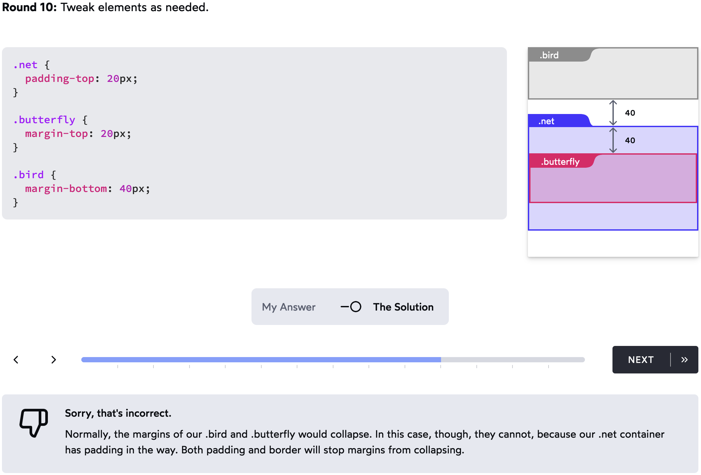


#### Using Margin Effectively
